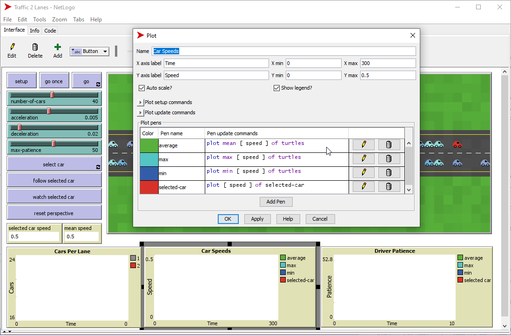
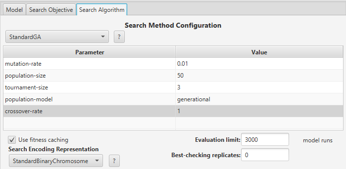
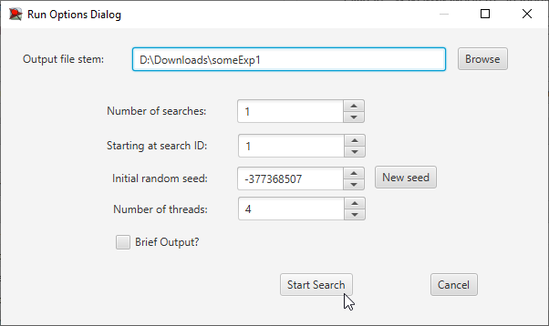
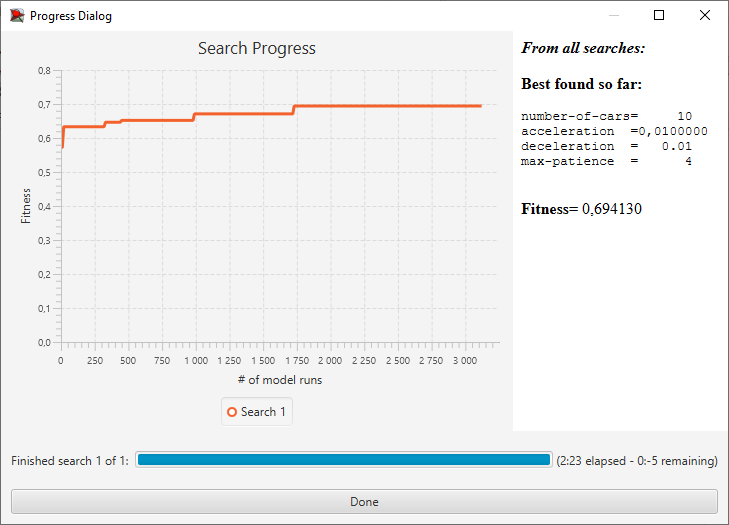
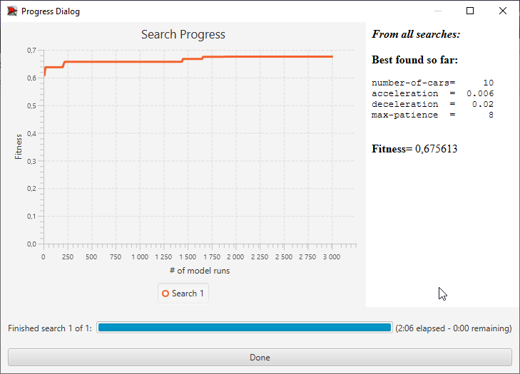

## Імітаційне моделювання комп'ютерних систем
## СПм-21-2, **Іванов Іван Іванович**
### Лабораторная работа №**3**. Использование средств вычислительного интеллекта для оптимизации имитационных моделей

 

### Выбранная модель в среде NetLogo:
[Traffic 2 Lanes](http://www.netlogoweb.org/launch#http://www.netlogoweb.org/assets/modelslib/Sample%20Models/Social%20Science/Traffic%202%20Lanes.nlogo)

 

#### Вербальное описание модели:
*В данном случае описание нужно, т.к. в аналогичных примерах для первой и второй лабораторных работ использовалась другая имитационная модель, и я не могу просто дать ссылку на описание из прошлой лабораторной работы. Здесь и **далее курсивом отмечены мои комментарии**, для лучшего пояснения описания работы.*  
Усложнённая версия модели [Traffic Basic](http://www.netlogoweb.org/launch#http://www.netlogoweb.org/assets/modelslib/Sample%20Models/Social%20Science/Traffic%20Basic.nlogo). Симуляция движения автомобилей по двухполосному шоссе, каждый автомобиль на дороге следует простому набору правил: замедляется при приближении к автомобилю перед собой (*догоняет его, и, чтобы не врезаться, тормозит*), или ускоряется, если впереди нет другого автомобиля. Также есть возможность поменять полосу движения, если водителю надело тормозить и соседняя полоса свободна. Модель демонстрирует, как могут образовываться пробки.

#### Управляющие параметры:
- **number-of-cars** определяет число агентов в среде моделирования, т.е., в данной модели, количество машин на замкнутом шоссе.
- **deceleration** определяет уменьшение скорости агента на каждом такте симуляции в случае наличия препятствия перед ним.
- **acceleration** определяет приращение скорости агента на каждом такте симуляции при отсутствии препятствий перед агентом.
- **max-patience** определяет, сколько раз автомобиль может понизить свою скорость, прежде чем у его водителя "закончится терпение" и он попытается сменить полосу движения.

#### Критерии эффективности системы:
- максимальная скорость на данном такте, т.е. скорость самой быстрой в данный момент машины.
- наименьшая скорость на данном такте, т.е. скорость самой медленной в данный момент машины.
- средняя скорость движения машин на шоссе.
- текущая скорость отслеживаемой машины (красная машина).

 

### Настройки среды BehaviorSearch:

**Выбранная модель**:
<pre>
C:\Program Files\NetLogo 6.3.0\models\Sample Models\Social Science\Traffic 2 Lanes.nlogo
</pre>
**Параметры модели**:  
*Параметры и их предполагаемые диапазоны были автоматически извлечены средой BehaviorSearch из выбранной имитационной модели, для этого есть кнопка «Загрузить диапазоны параметров из интерфейса модели»*:
<pre>
["number-of-cars" 10]
["acceleration" [0.001 0.001 0.01]]
["deceleration" [0.01 0.01 0.1]]
["max-patience" [1 1 100]] 
</pre>
*Число машин было мною снижено, по сравнению со значением по умолчанию, для сокращения времени симуляции, т.к. настройка этой модели демонстрировалась на лекции и был смысл не затягивать требуемое на анализ время.*  
Используемая **мера**:  
Для фитнес-функции *(она же функция приспособленности или целевая функция)* - было выбрано **значение средней скорости всех машин на трассе**, выражение для её расчёта взято из настроек графика рассматриваемой имитационной модели в среде NetLogo
  
и указано в параметре "**Measure**":
<pre>
mean [ speed ] of turtles
</pre>
Средняя скорость всех машин на трассе должна учитываться **в среднем** за весь период симуляции длительностью 500 тактов (ведь на каждом такте есть своё значение текущей средней скорости), начиная с 0 такта симуляции.  
*Параметр "**Mesure if**" со значение true, по сути, и означает, что учитываться будут все такты симуляции, а не часть из них. Иногда имеет смысл не учитывать некоторые такты, из-за хаоса в некоторых моделях в начале их использования. Например, это показано в примере из документации к BehaviorSearch.  
Параметры "**Setup**" и "**Go**" указывают соответствующие процедуры инициализации и запуска в логике модели (в большинстве они так и называются). BehaviorSearch в процессе работы, по сути, вместо пользователя запускает эти процедуры.*  
Параметр остановки по условию ("**Stop if**") в данном случае не использовался.
Общий вид вкладки настроек параметров:

**Настройки целевой функции** (Search Objective):  
Целью подбора параметров имитационной модели, описывающей дорожное движение по двухполосному шоссе, является **максимизация** значения средней скорости машин на трассе - это указано через параметр "**Goal**" со значением **Maximize Fitness**. Т.е. нужно найти такие параметры настроек модели, при которых машины двигаются с наибольшей скоростью. При этом интересует не просто средняя скорость всех машин в какой-то отдельный момент симуляции, а среднее её значение за всю симуляцию (длительность которой (500 шагов) указывалась на прошлой вкладке). Для этого в параметре "**Collected measure**", определяющем учет значений выбранного показателя, укзано **MEAN_ACROSS_STEPS**.  
Воизбежание искажения результатов из-за случайных значений, используемых в логике самой имитационной модели, **каждая симуляция повторяется по 10 раз**, результирующее значение расчитывается как **среднее арифметическое**. *Если считаете влияние случайности на происходящее в выбранной вами имитационной модели незначтельным - то повторные симуляции и не нужны.*  
Общий вид вкладки настроек целевой функции:

**Настройки алгоритма поиска** (Search Algorithm):  
*На этом этапе была определена модель, настроены её параметры (т.е. указано, какие из них неизменны, а какие в процессе поиска могут меняться и в каких диапазонах), и выбрана мера эффективности, лежащая в основе функции приспособленности, позводяющей оценить "качество" каждого из проверяемого BehaviorSearch варианта решения.  
В ходе исследования на лабораторной работе используются два алгоритма: Случайный поиск (**RandomSearch**) и Простой генетический алгоритм (**StandardGA**).  
Для этих алгоритмов, решающих задачу поиска такого набора параметров имитационной модели, чтобы удоволетворить требования пользователя (в нашем случае - максимизировать значение средней скорости перемещения агентов в заданной имитационной модели), необходимо указать "**Evaluation limit**" (число итераций поиска, в случае ГА - это будет число поколений), и "**Search Space Encoding Representation**" (способ кодирования варианта решения). Общепринятого "лучшего" способа кодирования нет, надо пробовать, какие подойдут именно к вашей модели.  
Параметр "**Use fitness caching**" влияет только на производительность.  
Параметры, специфичные для генетического алгоритма, можно использовать по умолчанию, если это не помешает получить результат. На защите их, конечно, обсудим*.  
Общий вид вкладки настроек алгоритма поиска:

 

### Результаты использования BehaviorSearch:
Диалоговое окно запуска поиска *(можно оставить по умолчанию, следите, куда пишется результат)*:

Результат поиска параметров имитационной модели, используя **генетический алгоритм**:

Результат поиска параметров имитационной модели, используя **случайный поиск**:
