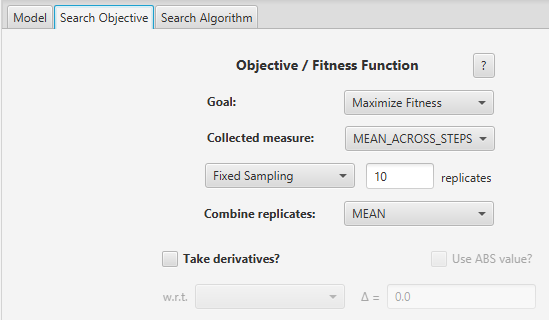

## Імітаційне моделювання комп'ютерних систем
## СПм-21-2, **Іванов Іван Іванович**
### Лабораторная работа №**3**. Использование средств вычислительного интеллекта для оптимизации имитационных моделей

 

### Выбранная модель в среде NetLogo:
[Traffic 2 Lanes](http://www.netlogoweb.org/launch#http://www.netlogoweb.org/assets/modelslib/Sample%20Models/Social%20Science/Traffic%202%20Lanes.nlogo)

 

### Вербальное описание модели:
*// в данном случае описание нужно, т.к. в аналогичных примерах для первой и второй лабораторных работ использовалась другая имитационная модель, и я не могу просто дать ссылку на описание из прошлой лабораторной работы.*  
Усложнённая версия модели [Traffic Basic](http://www.netlogoweb.org/launch#http://www.netlogoweb.org/assets/modelslib/Sample%20Models/Social%20Science/Traffic%20Basic.nlogo). Симуляция движения автомобилей по двухполосному шоссе, каждый автомобиль на дороге следует простому набору правил: замедляется при приближении к автомобилю перед собой (*догоняет его, и, чтобы не врезаться, тормозит*), или ускоряется, если впереди нет другого автомобиля. Также есть возможность поменять полосу движения, если водителю надело тормозить и соседняя полоса свободна. Модель демонстрирует, как могут образовываться пробки.

#### Управляющие параметры:
- **number-of-cars** определеяет число агентов в среде моделирования, т.е., в данной модели, количество машин на замкнутом шоссе.
- **deceleration** определеяет уменьшение скорости агента на каждом такте симуляции в случае наличия препятствия перед ним.
- **acceleration** определеяет приращение скорости агента на каждом такте симуляции при отсутствии препятствий перед агентом.
- **max-patience** определяет, сколько раз автомобиль может понизить свою скорость, прежде чем у его водителя "закончится терпение" и он попытается сменить полосу движения.

#### Критерии эффективности системы:
- максимальная скорость на данном такте, т.е. скорость самой быстрой в данный момент машины.
- наименьшая скорость на данном такте, т.е. скорость самой медленной в данный момент машины.
- средняя скорость движения машин на шоссе.
- текущая скорость отслеживаемой машины (красная машина).

### Настройки среды BehaviorSearch:

**Выбранная модель**:
<pre>
C:\Program Files\NetLogo 6.3.0\models\Sample Models\Social Science\Traffic 2 Lanes.nlogo
</pre>
**Параметры модели**:
<pre>
["number-of-cars" 10]
["acceleration" [0.001 0.001 0.01]]
["deceleration" [0.01 0.01 0.1]]
["max-patience" [1 1 100]] 
</pre>
*Число машин было снижено, по сравнению со значением по умолчанию, для сокращения времени симуляции, т.к. настройка этой модели демонстрировалась на лекции и был смысл не затягивать требуемое на анализ время.*  
Используемая **мера**:  
Для фитнес-функции *(она же функция приспособленности или целевая функция)* - было выбрано **значение средней скорости всех машин на трассе**, выражение для её расчёта взято из настроек графика рассматриваемой имитационной модели в среде NetLogo:
<pre>
mean [ speed ] of turtles
</pre>
Средняя скорость всех машин на трассе учитывается **в среднем** за весь период симуляции длительностью 500 тактов, начиная с 0 такта.  
Общий вид вкладки настроек параметров:

**Настройки целевой функции**:

Целью подбора параметров является **максимизация** значения средней скорости машин на трассе - т.е. найти такие параметры настроек модели, при которых машины на двухполосном шоссе двигаются с наибольшей скоростью, **в среднем** за всю симуляцию.
Воизбежание искажения результатов из-за случайных значений, используемых в логике самой имитационной модели, **каждая симуляция повторяется по 10 раз**, результирующее значения расчитывается как **среднее арифметическое**.  
Общий вид вкладки настроек целевой функции:

**Настройки алгоритма поиска**:
